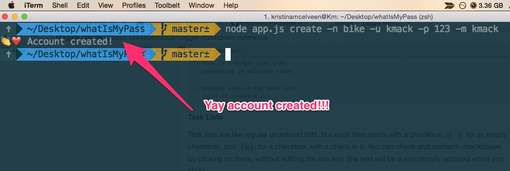
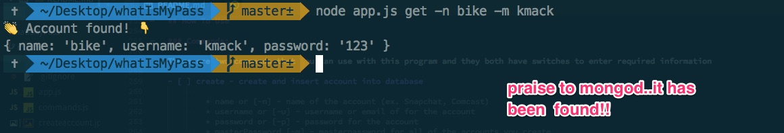
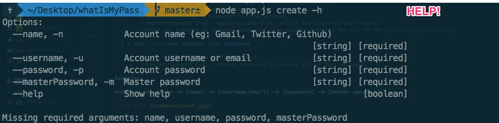

# Password Please?

## About Password Please

I have always been curious about mastering the commandline in an attempt to save for developer time. I combined this curiousity with my frustration with node (I love Express) and decided to build a commandline app. On top of curiousity and frustration comes with my everyday struggle to remember all of my passwords. Since I am super paraniod with using other password services, I decided to attempt to create my own password manager hence Password Please. You can insert an account (Twitter, Github or Instagram) along with the username/email and password for those accounts. The account that you create is encrypted and can be decrypted with the **master password**.

## How To Install

* Fork and clone the repo

* Cd into the repo and run ```npm install```. The following npm modules will be install:

    * crypto-js
    * yargs
    * underscore
    * emoji-node


```

├── README.md
├── app.js
├── commands.js
├── index.html
├── node_modules
│   ├── align-text
│   │   ├── LICENSE
│   │   ├── README.md
│   │   ├── index.js
│   │   └── package.json
│   ├── camelcase
│   │   ├── index.js
│   │   ├── license
│   │   ├── package.json
│   │   └── readme.md
│   ├── center-align
│   │   ├── LICENSE
│   │   ├── README.md
│   │   ├── index.js
│   │   ├── package.json
│   │   └── utils.js
│   ├── cliui
│   │   ├── LICENSE.txt
│   │   ├── README.md
│   │   ├── index.js
│   │   ├── package.json
│   │   └── test
│   │       └── cliui.js
│   ├── crypto-js
│   │   ├── CONTRIBUTING.md
│   │   ├── README.md
│   │   ├── aes.js
│   │   ├── bower.json
│   │   ├── cipher-core.js
│   │   ├── core.js
│   │   ├── crypto-js.js
│   │   ├── docs
│   │   │   └── QuickStartGuide.wiki
│   │   ├── enc-base64.js
│   │   ├── enc-hex.js
│   │   ├── enc-latin1.js
│   │   ├── enc-utf16.js
│   │   ├── enc-utf8.js
│   │   ├── evpkdf.js
│   │   ├── format-hex.js
│   │   ├── format-openssl.js
│   │   ├── hmac-md5.js
│   │   ├── hmac-ripemd160.js
│   │   ├── hmac-sha1.js
│   │   ├── hmac-sha224.js
│   │   ├── hmac-sha256.js
│   │   ├── hmac-sha3.js
│   │   ├── hmac-sha384.js
│   │   ├── hmac-sha512.js
│   │   ├── hmac.js
│   │   ├── index.js
│   │   ├── lib-typedarrays.js
│   │   ├── md5.js
│   │   ├── mode-cfb.js
│   │   ├── mode-ctr-gladman.js
│   │   ├── mode-ctr.js
│   │   ├── mode-ecb.js
│   │   ├── mode-ofb.js
│   │   ├── package.json
│   │   ├── pad-ansix923.js
│   │   ├── pad-iso10126.js
│   │   ├── pad-iso97971.js
│   │   ├── pad-nopadding.js
│   │   ├── pad-pkcs7.js
│   │   ├── pad-zeropadding.js
│   │   ├── pbkdf2.js
│   │   ├── rabbit-legacy.js
│   │   ├── rabbit.js
│   │   ├── rc4.js
│   │   ├── ripemd160.js
│   │   ├── sha1.js
│   │   ├── sha224.js
│   │   ├── sha256.js
│   │   ├── sha3.js
│   │   ├── sha384.js
│   │   ├── sha512.js
│   │   ├── tripledes.js
│   │   └── x64-core.js
│   ├── decamelize
│   │   ├── index.js
│   │   ├── license
│   │   ├── package.json
│   │   └── readme.md
│   ├── is-buffer
│   │   ├── LICENSE
│   │   ├── README.md
│   │   ├── index.js
│   │   ├── package.json
│   │   └── test
│   │       └── basic.js
│   ├── kind-of
│   │   ├── LICENSE
│   │   ├── README.md
│   │   ├── index.js
│   │   └── package.json
│   ├── lazy-cache
│   │   ├── LICENSE
│   │   ├── README.md
│   │   ├── index.js
│   │   └── package.json
│   ├── longest
│   │   ├── LICENSE
│   │   ├── README.md
│   │   ├── index.js
│   │   └── package.json
│   ├── minimist
│   │   ├── LICENSE
│   │   ├── example
│   │   │   └── parse.js
│   │   ├── index.js
│   │   ├── package.json
│   │   ├── readme.markdown
│   │   └── test
│   │       ├── dash.js
│   │       ├── default_bool.js
│   │       ├── dotted.js
│   │       ├── long.js
│   │       ├── parse.js
│   │       ├── parse_modified.js
│   │       ├── short.js
│   │       └── whitespace.js
│   ├── mkdirp
│   │   ├── LICENSE
│   │   ├── bin
│   │   │   ├── cmd.js
│   │   │   └── usage.txt
│   │   ├── examples
│   │   │   └── pow.js
│   │   ├── index.js
│   │   ├── package.json
│   │   ├── readme.markdown
│   │   └── test
│   │       ├── chmod.js
│   │       ├── clobber.js
│   │       ├── mkdirp.js
│   │       ├── opts_fs.js
│   │       ├── opts_fs_sync.js
│   │       ├── perm.js
│   │       ├── perm_sync.js
│   │       ├── race.js
│   │       ├── rel.js
│   │       ├── return.js
│   │       ├── return_sync.js
│   │       ├── root.js
│   │       ├── sync.js
│   │       ├── umask.js
│   │       └── umask_sync.js
│   ├── node-emoji
│   │   ├── LICENSE
│   │   ├── README.md
│   │   ├── index.js
│   │   ├── lib
│   │   │   ├── emoji.js
│   │   │   ├── emoji.json
│   │   │   ├── emojifile.js
│   │   │   └── emojiparse.js
│   │   ├── package.json
│   │   └── test
│   │       └── emoji.js
│   ├── node-persist
│   │   ├── README.md
│   │   ├── examples
│   │   │   └── counter
│   │   │       └── counter.js
│   │   ├── package.json
│   │   ├── src
│   │   │   ├── local-storage.js
│   │   │   └── node-persist.js
│   │   ├── temp.js
│   │   └── tests
│   │       └── index.js
│   ├── q
│   │   ├── LICENSE
│   │   ├── README.md
│   │   ├── package.json
│   │   ├── q.js
│   │   └── queue.js
│   ├── repeat-string
│   │   ├── LICENSE
│   │   ├── README.md
│   │   ├── index.js
│   │   └── package.json
│   ├── right-align
│   │   ├── LICENSE
│   │   ├── README.md
│   │   ├── index.js
│   │   └── package.json
│   ├── underscore
│   │   ├── LICENSE
│   │   ├── README.md
│   │   ├── package.json
│   │   ├── underscore-min.js
│   │   ├── underscore-min.map
│   │   └── underscore.js
│   ├── window-size
│   │   ├── LICENSE
│   │   ├── README.md
│   │   ├── cli.js
│   │   ├── index.js
│   │   └── package.json
│   ├── wordwrap
│   │   ├── README.markdown
│   │   ├── example
│   │   │   ├── center.js
│   │   │   └── meat.js
│   │   ├── index.js
│   │   ├── package.json
│   │   └── test
│   │       ├── break.js
│   │       ├── idleness.txt
│   │       └── wrap.js
│   └── yargs
│       ├── CHANGELOG.md
│       ├── LICENSE
│       ├── README.md
│       ├── completion.sh.hbs
│       ├── index.js
│       ├── lib
│       │   ├── completion.js
│       │   ├── parser.js
│       │   ├── usage.js
│       │   └── validation.js
│       └── package.json
└── package.json

```

## How To Use

### Commands:

There are two commands that you can use with this program and they both have switches to enter required information

- [ ] create - create and insert account into database

        * name or [-n] - name of the account (ex. Snapchat, Comcast)
        * username or [-u] - username or email of for the account
        * password or [-p] - password for the account
        * masterPassword [-m] - masterpassword for all of the accounts you create.
        **Once you created an account, use that same master password for all of the accounts you create**

- [ ] get - retrieve account from database

        * name or [-n] - name of the account
        * masterPassword [-m] - master password to access all of your accounts

Example:

node app.js create -n [name] -u [username/email] -p [password] -m [master password]




node app.js get -n [name] -m [master password]



node app.js -h [help]




